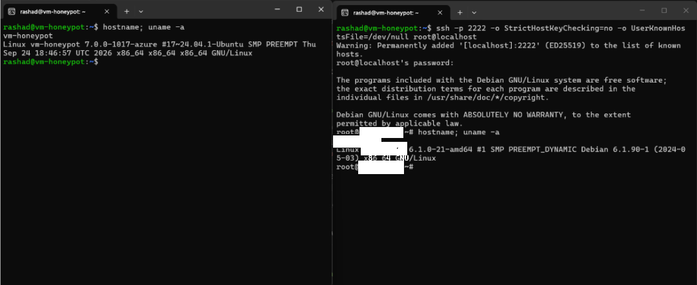
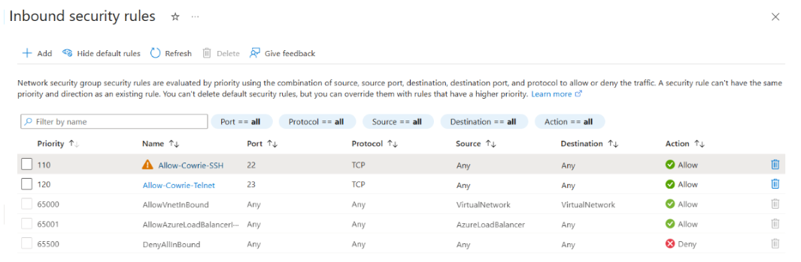
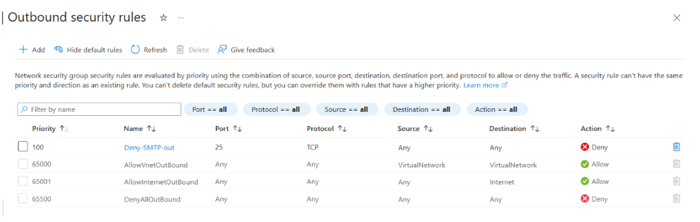

# Evidence

Raw command output that was captured during the build. The files are unedited
except for when I redacted things, like the internal addresses (replaced with
placeholders)

## Cowrie Deployment

| File | Purpose |
|---|---|
| `cowrie-service-evidence.txt` | Before the iptables redirect: Cowrie running under systemd as the unprivileged `cowrie` user, listening on 2222/2223; real sshd bound only to the Tailscale IP on 22222. After: NAT rules redirecting public 22/23 to Cowrie, scoped to `eth0`. |
| `nmap-targeted.txt` | External scan of the public IP: 22 and 23 open; Cowrie's real ports (2222/2223) and admin SSH (22222) filtered by the NSG. |
| `nmap-full.txt` | Full 65,535-port external scan: only 22 and 23 reachable. |

## Screenshots

### Sandbox Verification

**Left**: This represents the real VM, running Ubuntu 24.04 on an Azure kernel.

**Right**: This represents an SSH session into Cowrie on the same machine. The attacker would see
a fake Debian 12 host with its own hostname and kernel string (not the real system ofc). This 
confirms Cowrie is running in emulated-shell mode with no access to the real OS. 

### NSG Inbound Rules

Only TCP 22 (SSH) and TCP 23 (Telnet) are allowed in from the internet, and the host redirects both to
Cowrie. Every other inbound connection goes through Azure's default 'DenyAllInbound' rule. The real 
admin SSH (port 22222) has no allow rule, making it only reachable over Tailscale. (Also good to mention
that Azure flagged port 22 because we shouldn't normally expose SSH. In this case though, that's the
honeypot.)

### NSG Outbound Rules

'Deny-SMTP-Out' blocks outbound TCP 25, so even if something on the VM did end up getting compromised,
it couldn't be used to send spam, which Microsoft's AUP prohibits. Other outbound internet traffic
stays allowed since the VM needs it for updates/Tailscale/Wazuh.

## Tailscale Segmentation
| File | Purpose |
|---|---|
| `tailscale-acl-tests.txt` | From the VM over Tailscale, before Wazuh: Pi SSH and my laptop time out (blocked); Pi port 1514 is refused (allowed through, nothing listening yet). See `wazuh-port-tests.txt` for the same test after the Wazuh install. |

## Wazuh SIEM (Raspberry Pi)

| File | Purpose | 
|---|---|
| `wazuh-pi-ports.txt` | Wazuh's listening ports after the all-in-one install, plus the host firewall. The agent ports (1514/1515), API (55000) and dashboard (443) listen on all interfaces; the indexer (9200) is localhost-only. `ufw` denies all inbound traffic except on `tailscale0`, plus SSH from the home LAN as a fallback, so none of the Wazuh ports are reachable from the LAN. |
| `wazuh-port-tests.txt` | From the VM over Tailscale, after the install: Pi port 1514 now succeeds (since Wazuh is listening), while the Pi SSH still times out (blocked by tailnet policy). Compare with `tailscale-acl-tests.txt`, where 1514 was refused. | 
| `wazuh-agent-vm.txt` | On the VM: The Wazuh agent running and reading Cowrie's `cowrie.json`, with memory headroom on the 1 GiB VM (agent + Cowrie + swap). |
| `wazuh-cowrie-events.txt` | On the Pi: `vm-honeypot` registered and Active, and real Cowrie session events arriving at the manager, already split into fields by Wazuh's built-in JSON decoder. Only connect/closed events are included, so no attempted credentials. |